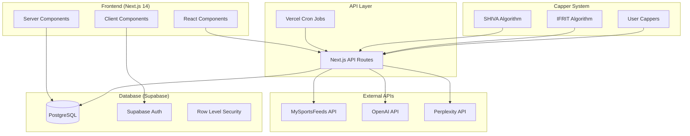
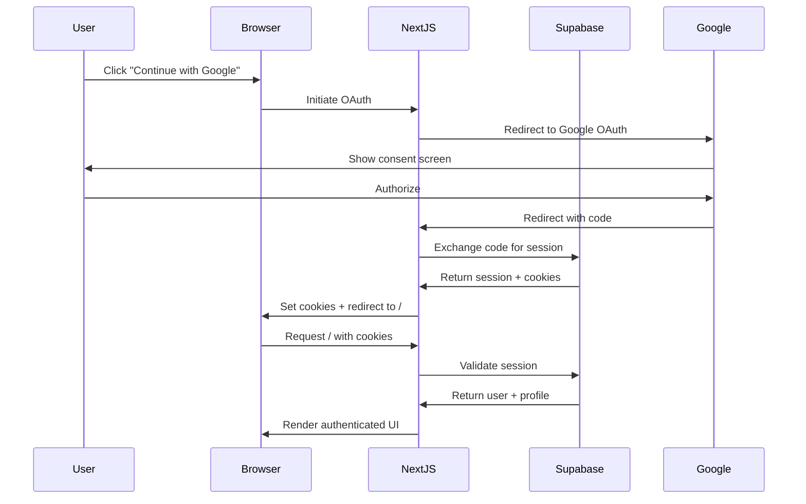
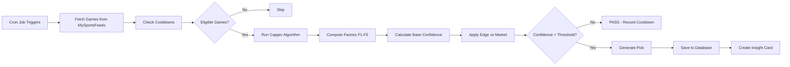
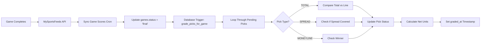

# 🤖 DeepPick AI Agent Onboarding Guide

**Last Updated:** 2025-11-13  
**Version:** 2.0  
**Purpose:** Complete knowledge transfer for AI agents working on the DeepPick sports betting platform

---

## 📋 Table of Contents

1. [Project Overview](#1-project-overview)
2. [Architecture & System Design](#2-architecture--system-design)
3. [File Structure & Organization](#3-file-structure--organization)
4. [Core Systems & Features](#4-core-systems--features)
5. [Database Details](#5-database-details)
6. [External Integrations](#6-external-integrations)
7. [Important Patterns & Conventions](#7-important-patterns--conventions)
8. [Key Files to Know](#8-key-files-to-know)
9. [Environment Variables & Configuration](#9-environment-variables--configuration)
10. [Common Tasks & Workflows](#10-common-tasks--workflows)
11. [Known Issues & Gotchas](#11-known-issues--gotchas)
12. [Recent Changes & Context](#12-recent-changes--context)

---

## 1. Project Overview

### What is DeepPick?

**DeepPick** is an AI-powered NBA sports betting platform where:
- **AI Cappers** (SHIVA, IFRIT) generate picks using sophisticated factor-based algorithms
- **Human Cappers** can create accounts, make picks, and compete on leaderboards
- **Free Users** can view AI-generated picks and analytics (read-only)
- **Admin Users** manage cappers, configure algorithms, and monitor system health

### Tech Stack

**Frontend:**
- **Framework:** Next.js 14 (App Router with React Server Components)
- **UI:** Tailwind CSS + shadcn/ui components
- **State Management:** React Context (AuthContext, BettingSlipContext)
- **Icons:** Lucide React
- **Maps:** Mapbox GL (for territory map visualization)

**Backend:**
- **Database:** Supabase (PostgreSQL with Row Level Security)
- **Authentication:** Supabase Auth with Google OAuth
- **API Routes:** Next.js API routes (`/api/*`)
- **Cron Jobs:** Vercel Cron (scheduled tasks)

**External APIs:**
- **MySportsFeeds:** Game data, player stats, odds, box scores
- **OpenAI:** Bold predictions, AI analysis, post-mortem insights
- **Perplexity:** Research and contextual analysis

**Deployment:**
- **Hosting:** Vercel
- **Database:** Supabase Cloud (Project ID: `xckbsyeaywrfzvcahhtk`)
- **Domain:** `https://deep-pick.com`

### User Roles

1. **Free (Default)** - View picks, leaderboard, analytics (read-only)
2. **Capper** - Make picks, appear on leaderboard, track performance (FREE during beta, normally $19.99/mo)
3. **Admin** - Full system access, manage cappers, configure algorithms

### Key Features

- **Dashboard** - Recent picks, performance charts, top cappers
- **Leaderboard** - Capper rankings by ROI, win rate, units won
- **Territory Map** - Visual representation of capper dominance by NBA team
- **Make Picks** - Betting slip interface for cappers to place picks
- **Insight Cards** - Detailed pick analysis with factor breakdowns
- **System Health** - Admin monitoring of algorithm runs and performance

---

## 2. Architecture & System Design

### High-Level Architecture



### Authentication Flow



### Pick Generation Flow



### Pick Grading Flow



---

## 3. File Structure & Organization

### Directory Tree

```
DeepPick App/
├── src/
│   ├── app/                          # Next.js App Router pages
│   │   ├── api/                      # API routes
│   │   │   ├── cappers/             # Capper-related endpoints
│   │   │   │   ├── [capper]/run/   # Unified pick generation
│   │   │   │   └── create/         # Create new capper
│   │   │   ├── cron/               # Scheduled tasks
│   │   │   │   ├── sync-mysportsfeeds-odds/  # Fetch odds (every 5 min)
│   │   │   │   ├── sync-game-scores/         # Update scores (every 10 min)
│   │   │   │   ├── shiva-auto-picks/         # SHIVA TOTAL picks (every 6 min)
│   │   │   │   ├── shiva-auto-picks-spread/  # SHIVA SPREAD picks (every 8 min)
│   │   │   │   └── auto-picks-multi/         # Multi-capper execution (every 4 min)
│   │   │   ├── picks/              # Pick management
│   │   │   │   ├── route.ts        # Fetch picks
│   │   │   │   └── grade/          # Manual grading endpoint
│   │   │   ├── factors/            # Factor configuration
│   │   │   └── shiva/              # SHIVA-specific endpoints
│   │   ├── admin/                  # Admin pages
│   │   │   └── system-health/      # System monitoring
│   │   ├── cappers/                # Capper pages
│   │   │   ├── shiva/              # SHIVA management UI
│   │   │   ├── ifrit/              # IFRIT management UI
│   │   │   └── create/             # Create new capper wizard
│   │   ├── leaderboard/            # Leaderboard page
│   │   ├── territory-map/          # Territory map visualization
│   │   ├── make-picks/             # Manual picks interface
│   │   ├── upgrade/                # Upgrade to capper page
│   │   ├── login/                  # Login page
│   │   ├── auth/callback/          # OAuth callback handler
│   │   ├── layout.tsx              # Root layout with auth
│   │   └── page.tsx                # Dashboard (home page)
│   ├── components/                 # React components
│   │   ├── ui/                     # shadcn/ui components
│   │   ├── navigation/             # NavBar, UserMenu
│   │   ├── picks/                  # Pick cards, betting slip
│   │   ├── dashboard/              # Dashboard components
│   │   ├── leaderboard/            # Leaderboard components
│   │   └── auth/                   # Auth components
│   ├── contexts/                   # React contexts
│   │   ├── auth-context.tsx        # Auth state management
│   │   └── betting-slip-context.tsx # Betting slip state
│   ├── lib/                        # Utilities and services
│   │   ├── supabase/               # Supabase clients
│   │   │   ├── client.ts           # Browser client
│   │   │   └── server.ts           # Server client + admin
│   │   ├── cappers/                # Capper algorithms
│   │   │   ├── shiva-v1/           # SHIVA algorithm implementation
│   │   │   │   ├── orchestrator.ts # Main pipeline orchestrator
│   │   │   │   ├── confidence-calculator.ts # Confidence scoring
│   │   │   │   ├── factors/        # Factor implementations
│   │   │   │   │   ├── nba-totals-orchestrator.ts # TOTALS factors
│   │   │   │   │   ├── nba-spread-orchestrator.ts # SPREAD factors
│   │   │   │   │   ├── f1-pace-index.ts
│   │   │   │   │   ├── f2-offensive-form.ts
│   │   │   │   │   ├── f3-defensive-erosion.ts
│   │   │   │   │   ├── f4-three-point-env.ts
│   │   │   │   │   ├── f5-free-throw-env.ts
│   │   │   │   │   └── s1-s5-*.ts  # SPREAD factors
│   │   │   │   └── services/       # Reusable services
│   │   │   └── shiva-wizard-orchestrator.ts # UI wizard pipeline
│   │   ├── data-sources/           # External API integrations
│   │   │   ├── mysportsfeeds-api.ts # MySportsFeeds client
│   │   │   ├── mysportsfeeds-stats.ts # Stats fetcher
│   │   │   ├── mysportsfeeds-cache.ts # Supabase caching
│   │   │   └── team-mappings.ts    # Team name normalization
│   │   ├── ai/                     # AI integrations
│   │   │   └── ai-capper-orchestrator.ts # OpenAI/Perplexity
│   │   └── utils.ts                # Helper functions
│   ├── types/                      # TypeScript types
│   │   ├── factors.ts              # Factor types
│   │   ├── factor-config.ts        # Factor configuration types
│   │   └── supabase.ts             # Database types
│   └── middleware.ts               # Route protection
├── supabase/
│   └── migrations/                 # Database migrations
│       ├── 001_initial_schema.sql
│       ├── 020_fix_pick_grading_complete.sql # Pick grading trigger
│       └── ...
├── public/                         # Static assets
├── .env.local                      # Environment variables
├── vercel.json                     # Cron job configuration
├── package.json                    # Dependencies
└── tsconfig.json                   # TypeScript config
```

### Naming Conventions

- **Components:** PascalCase (e.g., `NavBar.tsx`, `PickCard.tsx`)
- **API Routes:** kebab-case (e.g., `sync-game-scores/route.ts`)
- **Utilities:** camelCase (e.g., `calculateConfidence()`)
- **Database Tables:** snake_case (e.g., `user_cappers`, `pick_generation_cooldowns`)
- **Capper IDs:** lowercase (e.g., `shiva`, `ifrit`, `user-capper-123`)

---

## 4. Core Systems & Features

### 4.1 Capper System

**AI Cappers:**
- **SHIVA** - Statistical Hybrid Intelligence & Vegas Analysis
  - Supports TOTAL and SPREAD picks
  - Uses 5 base factors (F1-F5) + Edge vs Market
  - Configurable factor weights (250% budget for F1-F5, 100% for Edge)
  - Confidence threshold: 6.0 for HIGH, 4.0 for MEDIUM
  
- **IFRIT** - Aggressive OVER specialist
  - Focuses on high-scoring games
  - Simpler algorithm than SHIVA

**User Cappers:**
- Created via `/cappers/create` wizard
- Custom factor configurations per bet type
- Stored in `user_cappers` table
- Execution schedules auto-created via database trigger

### 4.2 Pick Generation System

**7-Step Wizard Pipeline** (SHIVA):

1. **Step 1: Initialize Run** - Create run record, select game
2. **Step 2: Capture Odds Snapshot** - Lock in market odds at pick time
3. **Step 3: Compute Factors** - Calculate F1-F5 base factors
4. **Step 4: Generate Predictions** - Calculate baseline total + factor adjustments
5. **Step 5: Apply Market Edge** - Compare prediction vs market line
6. **Step 6: Generate Pick** - Determine PICK/PASS based on confidence
7. **Step 7: Create Insight Card** - Generate AI analysis and save pick

**Cooldown System:**
- **Duration:** 2 hours after PASS decision
- **Purpose:** Prevent re-analyzing same game
- **Table:** `pick_generation_cooldowns`
- **Bypass:** If total line changes significantly (for TOTAL picks)

**Run Metadata:**
- **Locked Odds:** Stored in `run.metadata.locked_odds`
- **Source of Truth:** Used for pick grading (not current odds)
- **Includes:** `total_line`, `spread_line`, `moneyline_home`, `moneyline_away`

### 4.3 Factor System

**Base Factors (F1-F5)** - Sport/Bet Type Specific

**NBA TOTALS Factors:**
- **F1: Pace Index** (⏱️) - Expected game pace vs league average
- **F2: Offensive Form** (🔥) - Recent offensive efficiency trends
- **F3: Defensive Erosion** (🛡️) - Defensive vulnerability analysis
- **F4: Three-Point Environment** (🎯) - 3PT shooting variance
- **F5: Free Throw Environment** (🎁) - Free throw rate analysis

**NBA SPREAD Factors:**
- **S1: Net Rating Differential** - Team quality gap
- **S2: Turnover Differential** - Ball security advantage
- **S3: Shooting Efficiency Momentum** - Hot/cold shooting trends
- **S4: Pace Mismatch** - Tempo control advantage
- **S5: Four Factors Differential** - Comprehensive team comparison

**Global Factors:**
- **Edge vs Market (TOTALS)** - Predicted total vs market line
- **Edge vs Market (SPREAD)** - Predicted margin vs market spread

**Weight Budget:**
- F1-F5 (or S1-S5): **250% total** (distributed across enabled factors)
- Edge vs Market: **100%** (fixed, always enabled)
- **Total Budget:** 350%

### 4.4 Confidence Calculation

**Formula** (Over/Under Score Model for TOTALS):

```typescript
// Each factor produces overScore and underScore (both >= 0)
totalOverScore = sum(factor.overScore * factor.weight)
totalUnderScore = sum(factor.underScore * factor.weight)

// Pick direction = whichever is higher
if (totalOverScore > totalUnderScore) {
  pick = "OVER"
  confidence = totalOverScore
} else {
  pick = "UNDER"
  confidence = totalUnderScore
}

// Confidence thresholds
if (confidence >= 6.0) → HIGH confidence
else if (confidence >= 4.0) → MEDIUM confidence
else → PASS (record cooldown)
```

**For SPREAD picks:**
- Same logic but with `awayScore` and `homeScore` instead
- Higher score determines which team to pick

### 4.5 Pick Grading System

**Automatic Grading Trigger:**

```sql
-- Fires when games.status changes to 'final'
CREATE TRIGGER trigger_grade_picks
  AFTER UPDATE OF status ON games
  FOR EACH ROW
  EXECUTE FUNCTION grade_picks_for_game();
```

**Grading Logic:**

**TOTAL Picks:**
```
finalTotal = home_score + away_score
if (finalTotal > line) → OVER wins
if (finalTotal < line) → UNDER wins
if (finalTotal == line) → PUSH
```

**SPREAD Picks:**
```
margin = home_score - away_score
adjustedMargin = margin + spread_line
if (adjustedMargin > 0) → Home team covers
if (adjustedMargin < 0) → Away team covers
if (adjustedMargin == 0) → PUSH
```

**MONEYLINE Picks:**
```
if (home_score > away_score) → Home team wins
if (away_score > home_score) → Away team wins
if (home_score == away_score) → PUSH (rare in NBA)
```

**Net Units Calculation:**
```
WIN: +units (1:1 payout for standard -110 odds)
LOSS: -units
PUSH: 0 units
```

### 4.6 Leaderboard System

**Metrics Tracked:**
- **Units Won:** Total profit/loss in units
- **Win Rate:** Percentage of picks won
- **ROI:** Return on investment percentage
- **Total Picks:** Number of picks made
- **Wins/Losses/Pushes:** Pick outcome breakdown

**Ranking:** Sorted by units won (descending)

**Filters:**
- Time period (Last 7 days, Last 30 days, All time)
- Bet type (TOTAL, SPREAD, MONEYLINE, All)
- Sport (NBA, All)

### 4.7 Territory Map

**Visualization:**
- Interactive map showing capper dominance by NBA team
- Color-coded by capper (SHIVA = blue, IFRIT = red, etc.)
- Hover shows team stats and dominant capper
- Uses Mapbox GL for rendering

**Data Source:**
- Aggregates picks by team and capper
- Calculates win rate and units won per team
- Determines dominant capper based on performance

### 4.8 Dashboard

**Components:**
- **Elite Picks** - Recent high-confidence picks
- **Performance Chart** - Daily units and cumulative performance
- **Top Cappers** - Leaderboard preview
- **Pick History** - Recent picks with results

---

## 5. Database Details

### Key Tables

**`games`** - NBA games with odds and scores
```sql
id UUID PRIMARY KEY
api_event_id TEXT UNIQUE  -- 'msf_{gameId}'
sport TEXT                -- 'nba'
league TEXT               -- 'NBA'
home_team JSONB           -- { name, abbreviation }
away_team JSONB           -- { name, abbreviation }
game_date DATE
game_time TIME
status TEXT               -- 'scheduled', 'final'
home_score INTEGER
away_score INTEGER
odds JSONB                -- Sportsbook odds
total_line DECIMAL
spread_line DECIMAL
created_at TIMESTAMPTZ
updated_at TIMESTAMPTZ
```

**`picks`** - All picks (AI and human)
```sql
id UUID PRIMARY KEY
game_id UUID REFERENCES games(id)
capper TEXT               -- 'shiva', 'ifrit', user_id
pick_type TEXT            -- 'total', 'spread', 'moneyline'
selection TEXT            -- 'OVER 235.5', 'LAL -4.5', etc.
odds INTEGER              -- American odds
units DECIMAL             -- Bet size (1-5)
confidence DECIMAL        -- 0-100 or confidence score
status TEXT               -- 'pending', 'won', 'lost', 'push'
net_units DECIMAL         -- Profit/loss after grading
game_snapshot JSONB       -- Game details at pick time
run_id TEXT               -- Link to shiva_runs
graded_at TIMESTAMPTZ
created_at TIMESTAMPTZ
```

**`user_cappers`** - Custom capper configurations
```sql
id UUID PRIMARY KEY
capper_id TEXT UNIQUE     -- 'user-capper-123'
display_name TEXT
description TEXT
color_theme TEXT
sport TEXT                -- 'NBA', 'NFL', etc.
bet_types TEXT[]          -- ['TOTAL', 'SPREAD']
factor_config JSONB       -- { TOTAL: { enabled_factors, weights }, SPREAD: {...} }
execution_interval_minutes INTEGER
execution_priority INTEGER
is_active BOOLEAN
created_at TIMESTAMPTZ
updated_at TIMESTAMPTZ
```

**`capper_execution_schedules`** - Cron job schedules
```sql
id UUID PRIMARY KEY
capper_id TEXT REFERENCES user_cappers(capper_id)
sport TEXT
bet_type TEXT
interval_minutes INTEGER
priority INTEGER
is_active BOOLEAN
last_run_at TIMESTAMPTZ
next_run_at TIMESTAMPTZ
```

**`pick_generation_cooldowns`** - Cooldown tracking
```sql
id UUID PRIMARY KEY
game_id UUID REFERENCES games(id)
capper TEXT
bet_type TEXT             -- 'total', 'spread', 'moneyline'
result TEXT               -- 'PASS', 'PICK_GENERATED'
units DECIMAL
confidence_score DECIMAL
reason TEXT
cooldown_until TIMESTAMPTZ
total_line DECIMAL        -- For line change detection
created_at TIMESTAMPTZ
UNIQUE(game_id, capper, bet_type)
```

**`profiles`** - User profiles
```sql
id UUID PRIMARY KEY REFERENCES auth.users(id)
email TEXT
full_name TEXT
username TEXT
role TEXT                 -- 'free', 'capper', 'admin'
email_verified BOOLEAN
avatar_url TEXT
bio TEXT
created_at TIMESTAMPTZ
updated_at TIMESTAMPTZ
```

**`shiva_runs`** - SHIVA algorithm execution logs
```sql
id TEXT PRIMARY KEY       -- 'shiva_{timestamp}_{random}'
game_id UUID REFERENCES games(id)
capper TEXT
sport TEXT
bet_type TEXT
state TEXT                -- 'running', 'completed', 'failed'
metadata JSONB            -- Full run details
created_at TIMESTAMPTZ
completed_at TIMESTAMPTZ
```

### Important Triggers

**`create_profile_for_new_user()`** - Auto-create profile on signup
```sql
CREATE TRIGGER on_auth_user_created
  AFTER INSERT ON auth.users
  FOR EACH ROW
  EXECUTE FUNCTION create_profile_for_new_user();
```

**`grade_picks_for_game()`** - Auto-grade picks when game completes
```sql
CREATE TRIGGER trigger_grade_picks
  AFTER UPDATE OF status ON games
  FOR EACH ROW
  EXECUTE FUNCTION grade_picks_for_game();
```

**`create_execution_schedules_for_capper()`** - Auto-create schedules for new cappers
```sql
CREATE TRIGGER on_user_capper_created
  AFTER INSERT ON user_cappers
  FOR EACH ROW
  EXECUTE FUNCTION create_execution_schedules_for_capper();
```

### Row Level Security (RLS)

**Policies:**
- Users can view all picks (public data)
- Only cappers/admins can insert picks
- Users can only update their own profiles
- Admins can access all data

---

## 6. External Integrations

### 6.1 MySportsFeeds API

**Base URL:** `https://api.mysportsfeeds.com/v2.1/pull/nba`

**Authentication:** Basic Auth with API key

**Rate Limiting:**
- **Global Backoff:** 30 seconds between ALL requests
- **Reason:** Even with Live tier, hitting 429 rate limits
- **Implementation:** Global queue in `mysportsfeeds-api.ts`

**Key Endpoints:**

1. **`/date/{YYYYMMDD}/odds_gamelines.json`** - Fetch odds for a date
   - Returns: Sportsbook odds (spread, total, moneyline)
   - Used by: `/api/cron/sync-mysportsfeeds-odds`

2. **`/date/{YYYYMMDD}/games.json`** - Fetch games for a date
   - Returns: Game schedule with scores
   - Used by: `/api/cron/sync-game-scores`

3. **`/team_gamelogs.json?team={ABBREV}&limit={N}`** - Fetch team stats
   - Returns: Last N games for a team
   - Used by: Factor calculations (F1-F5)
   - **Cached:** 15 minutes in Supabase (`team_stats_cache` table)

4. **`/game_boxscore/{gameId}.json`** - Fetch box score
   - Returns: Detailed game stats
   - Used by: Post-mortem analysis

5. **`/date/{YYYYMMDD}/player_injuries.json`** - Fetch injuries
   - Returns: Player injury status
   - Used by: F6 Injury Availability factor
   - **Cached:** 5 minutes in memory

**Caching Strategy:**
- **Team Stats:** 15 min TTL in Supabase (`team_stats_cache`)
- **Player Injuries:** 5 min TTL in memory
- **Purpose:** Reduce API calls and avoid rate limits

### 6.2 OpenAI API

**Model:** GPT-4 Turbo

**Use Cases:**
1. **Bold Predictions** - Player performance predictions
2. **AI Analysis** - Pick reasoning and insights
3. **Post-Mortem** - Results analysis after game completes

**Example Prompt (Bold Predictions):**
```
Generate 3 bold player predictions for {game}:
- Focus on key players likely to impact the total
- Include specific stat lines (e.g., "Booker 30+ PTS")
- Explain why each prediction matters for OVER/UNDER
```

### 6.3 Perplexity API

**Model:** Perplexity Sonar

**Use Cases:**
1. **Research** - Recent news, injuries, trends
2. **Contextual Analysis** - Team dynamics, matchup history

**Example Query:**
```
Research the Lakers vs Grizzlies game on {date}:
- Recent team performance and trends
- Key injuries or lineup changes
- Historical matchup data
- Any relevant news or context
```

---

## 7. Important Patterns & Conventions

### 7.1 Factor System

**Factor Structure:**
```typescript
interface FactorComputation {
  key: string              // 'paceIndex', 'offensiveForm', etc.
  name: string             // Display name
  overScore: number        // Points favoring OVER (>= 0)
  underScore: number       // Points favoring UNDER (>= 0)
  notes: string            // Human-readable explanation
  raw_values_json: object  // Raw data for debugging
}
```

**For SPREAD factors:**
- Use `awayScore` and `homeScore` instead of `overScore`/`underScore`
- Same calculation logic applies

**Weight Application:**
```typescript
// Weights are percentages (0-100)
// DO NOT normalize - they're already percentages
weightedOverScore = factor.overScore * (factor.weight / 100)
```

### 7.2 Confidence Thresholds

**TOTALS:**
- **HIGH:** confidence >= 6.0 → 3-5 units
- **MEDIUM:** confidence >= 4.0 → 1-2 units
- **PASS:** confidence < 4.0 → Record cooldown

**SPREAD:**
- Same thresholds as TOTALS
- Confidence score determines pick strength

### 7.3 Bet Type Handling

**TOTAL Picks:**
- Selection format: `"OVER 235.5"` or `"UNDER 235.5"`
- Line stored in `run.metadata.locked_odds.total_line`
- Grading: Compare `home_score + away_score` vs `line`

**SPREAD Picks:**
- Selection format: `"LAL -4.5"` or `"MEM +4.5"`
- **CRITICAL:** Home/away spreads are ALWAYS opposite signs
  - If home is -4.5, away is +4.5
  - They sum to zero
- Line stored in `run.metadata.locked_odds.spread_line`
- Grading: Check if team covered the spread

**MONEYLINE Picks:**
- Selection format: `"LAL ML"` or `"MEM ML"`
- Odds stored in `run.metadata.locked_odds.moneyline_home/away`
- Grading: Check if team won outright

### 7.4 Run Metadata (Source of Truth)

**Why it matters:**
- Odds change constantly
- Must use odds from pick generation time, not current odds
- Stored in `shiva_runs.metadata.locked_odds`

**Structure:**
```json
{
  "locked_odds": {
    "total_line": 235.5,
    "spread_line": -4.5,
    "moneyline_home": -180,
    "moneyline_away": 150,
    "captured_at": "2025-11-13T12:00:00Z"
  }
}
```

### 7.5 Cooldown System

**Purpose:** Prevent re-analyzing same game after PASS

**Duration:** 2 hours

**Bypass Conditions:**
- For TOTAL picks: If `total_line` changes by >= 1.0 point
- For SPREAD picks: If `spread_line` changes by >= 1.0 point

**Implementation:**
```typescript
// Check cooldown before running algorithm
const canGenerate = await pickGenerationService.canGeneratePick(
  gameId,
  capperId,
  betType,
  2 // 2 hour cooldown
)

if (!canGenerate) {
  // Check if line changed significantly
  if (lineChangedEnough) {
    // Bypass cooldown, run algorithm
  } else {
    // Skip game
  }
}
```

### 7.6 Missing Market Data = PASS

**CRITICAL RULE:**
- If market odds are unavailable, **ALWAYS PASS**
- **NEVER** use fallback/default values
- Prevents bad picks based on stale/incorrect data

**Example:**
```typescript
if (!marketTotalLine || marketTotalLine === 0) {
  return {
    decision: 'PASS',
    reason: 'Missing market total line'
  }
}
```

---

## 8. Key Files to Know

### Authentication

**`src/lib/supabase/server.ts`**
- Server-side Supabase client
- Admin client (bypasses RLS)
- Used in API routes and Server Components

**`src/lib/supabase/client.ts`**
- Browser-side Supabase client
- Used in Client Components
- Respects RLS policies

**`src/contexts/auth-context.tsx`**
- Client-side auth state management
- Provides `user`, `profile`, `loading` to components
- Handles auth state changes

**`src/middleware.ts`**
- Route protection based on user role
- Session validation
- Redirects unauthenticated users

**`src/app/auth/callback/route.ts`**
- OAuth callback handler
- Exchanges code for session
- Sets cookies and redirects

### Capper Logic

**`src/lib/cappers/shiva-v1/orchestrator.ts`**
- Main SHIVA pipeline orchestrator
- Coordinates all 7 steps
- Returns final pick decision

**`src/lib/cappers/shiva-v1/confidence-calculator.ts`**
- Confidence scoring logic
- Over/Under score model
- Threshold-based PICK/PASS decisions

**`src/lib/cappers/shiva-v1/factors/nba-totals-orchestrator.ts`**
- Coordinates F1-F5 factor calculations
- Fetches NBA stats bundle
- Returns weighted factors

**`src/lib/cappers/shiva-v1/factors/nba-spread-orchestrator.ts`**
- Coordinates S1-S5 factor calculations
- Similar to totals but for spread picks

**`src/app/api/cappers/[capper]/run/route.ts`**
- Unified pick generation endpoint
- Handles all cappers (SHIVA, IFRIT, user cappers)
- Acquires lock, selects game, runs algorithm

### Pick Grading

**`supabase/migrations/020_fix_pick_grading_complete.sql`**
- Pick grading trigger function
- Handles TOTAL, SPREAD, MONEYLINE picks
- Calculates net units and updates status

**`src/app/api/picks/grade/route.ts`**
- Manual grading endpoint (for testing)
- Same logic as trigger function

### UI Components

**`src/components/navigation/nav-bar.tsx`**
- Main navigation bar
- Custom basketball + AI neural network logo
- User menu, upgrade button

**`src/components/picks/pick-card.tsx`**
- Individual pick display
- Shows confidence, factors, reasoning

**`src/components/dashboard/real-dashboard.tsx`**
- Main dashboard component
- Elite picks, performance chart, leaderboard

---

## 9. Environment Variables & Configuration

### Required Environment Variables

```bash
# Supabase
NEXT_PUBLIC_SUPABASE_URL=https://xckbsyeaywrfzvcahhtk.supabase.co
NEXT_PUBLIC_SUPABASE_ANON_KEY=eyJhbGci...
SUPABASE_SERVICE_ROLE_KEY=eyJhbGci...  # Admin access (server-side only)

# MySportsFeeds
MYSPORTSFEEDS_API_KEY=79d80a1a-1152-49c3-a265-8f5e92...

# Google OAuth
GOOGLE_CLIENT_ID=your-google-client-id.apps.googleusercontent.com
GOOGLE_CLIENT_SECRET=your-google-client-secret

# OpenAI (optional - for AI features)
OPENAI_API_KEY=sk-...

# Perplexity (optional - for research features)
PERPLEXITY_API_KEY=pplx-...

# Mapbox (for territory map)
NEXT_PUBLIC_MAPBOX_TOKEN=pk.eyJ1...

# Feature Flags
NEXT_PUBLIC_SHIVA_V1_UI_ENABLED=true
NEXT_PUBLIC_SHIVA_V1_API_ENABLED=true
NEXT_PUBLIC_SHIVA_V1_WRITE_ENABLED=true
```

### Vercel Cron Jobs

**`vercel.json`:**
```json
{
  "crons": [
    {
      "path": "/api/cron/sync-mysportsfeeds-odds",
      "schedule": "*/5 * * * *"  // Every 5 minutes
    },
    {
      "path": "/api/cron/sync-game-scores",
      "schedule": "*/10 * * * *"  // Every 10 minutes
    },
    {
      "path": "/api/cron/shiva-auto-picks",
      "schedule": "*/6 * * * *"  // Every 6 minutes (TOTALS)
    },
    {
      "path": "/api/cron/shiva-auto-picks-spread",
      "schedule": "*/8 * * * *"  // Every 8 minutes (SPREAD)
    },
    {
      "path": "/api/cron/auto-picks-multi",
      "schedule": "*/4 * * * *"  // Every 4 minutes (all cappers)
    }
  ]
}
```

---

## 10. Common Tasks & Workflows

### 10.1 Add a New Factor

1. **Create factor implementation file:**
   - For TOTALS: `src/lib/cappers/shiva-v1/factors/f6-new-factor.ts`
   - For SPREAD: `src/lib/cappers/shiva-v1/factors/s6-new-factor.ts`

2. **Implement factor function:**
```typescript
export function computeNewFactor(
  bundle: NBAStatsBundle,
  ctx: RunCtx
): FactorComputation {
  // Calculate raw value
  const rawValue = /* your calculation */
  
  // Convert to overScore/underScore
  const overScore = rawValue > 0 ? rawValue : 0
  const underScore = rawValue < 0 ? Math.abs(rawValue) : 0
  
  return {
    key: 'newFactor',
    name: 'New Factor',
    overScore,
    underScore,
    notes: `Explanation of ${rawValue}`,
    raw_values_json: { rawValue }
  }
}
```

3. **Register in factor registry:**
   - Add to `src/lib/cappers/shiva-v1/factor-registry.ts`

4. **Add to orchestrator:**
   - Update `nba-totals-orchestrator.ts` or `nba-spread-orchestrator.ts`
   - Add conditional check for enabled factor

5. **Update UI:**
   - Add to factor configuration modal
   - Add icon and description

### 10.2 Create a New Capper

**Via UI:**
1. Navigate to `/cappers/create`
2. Fill in capper details (name, description, color)
3. Select sport and bet types
4. Configure factors and weights
5. Submit - execution schedules auto-created

**Via API:**
```typescript
POST /api/cappers/create
{
  "capper_id": "my-capper",
  "display_name": "My Capper",
  "description": "Custom capper description",
  "color_theme": "blue",
  "sport": "NBA",
  "bet_types": ["TOTAL", "SPREAD"],
  "factor_config": {
    "TOTAL": {
      "enabled_factors": ["paceIndex", "offensiveForm"],
      "weights": { "paceIndex": 125, "offensiveForm": 125 }
    }
  },
  "execution_interval_minutes": 15,
  "execution_priority": 5
}
```

### 10.3 Modify Pick Grading Logic

1. **Edit trigger function:**
   - File: `supabase/migrations/020_fix_pick_grading_complete.sql`
   - Modify `grade_picks_for_game()` function

2. **Test locally:**
   - Use `/api/picks/grade` endpoint
   - Pass `pick_id` to manually grade a pick

3. **Deploy to Supabase:**
   - Run migration via Supabase dashboard
   - Or use Supabase CLI: `supabase db push`

4. **Verify:**
   - Check `picks` table for updated `status` and `net_units`
   - Check `graded_at` timestamp

### 10.4 Update Leaderboard

**Leaderboard is auto-calculated from `picks` table:**
- No manual updates needed
- Aggregates picks by capper
- Calculates win rate, ROI, units won

**To add new metrics:**
1. Update query in `/api/leaderboard/route.ts`
2. Add new columns to leaderboard UI
3. Update sorting logic if needed

### 10.5 Add a New Bet Type

1. **Update database enum:**
```sql
ALTER TYPE bet_type ADD VALUE 'PROP';
```

2. **Create factor implementations:**
   - New orchestrator file (e.g., `nba-prop-orchestrator.ts`)
   - Individual factor files (e.g., `p1-player-prop.ts`)

3. **Update confidence calculator:**
   - Add prop-specific logic if needed

4. **Update pick grading:**
   - Add prop grading logic to `grade_picks_for_game()`

5. **Update UI:**
   - Add prop option to bet type selectors
   - Update pick cards to display prop picks

---

## 11. Known Issues & Gotchas

### 11.1 OAuth Session Persistence (FIXED)

**Issue:** Users had to sign in twice for session to persist

**Root Cause:** Race condition between OAuth callback setting cookies and middleware reading them

**Fix:** Added session refresh in middleware
```typescript
const { data: { user } } = await supabase.auth.getUser()
await supabase.auth.getSession() // Refresh session to ensure cookies are current
```

**Status:** ✅ Fixed in commit `1b8fbdd`

### 11.2 Spread Data Handling

**CRITICAL:** Home/away spreads are ALWAYS opposite signs
- If home is -4.5, away is +4.5
- They sum to zero
- Never store both - derive one from the other

**Example:**
```typescript
// CORRECT
const homeSpread = -4.5
const awaySpread = -homeSpread // +4.5

// WRONG
const homeSpread = -4.5
const awaySpread = -4.5 // ❌ Both negative!
```

### 11.3 Missing Market Odds = PASS

**Rule:** If accurate sportsbook odds are unavailable, PASS

**Why:** Prevents bad picks based on stale/incorrect data

**Implementation:**
```typescript
if (!marketTotalLine || marketTotalLine === 0) {
  return { decision: 'PASS', reason: 'Missing market odds' }
}
```

### 11.4 Factor Display Formatting

**TOTALS:** Show factor contribution to OVER/UNDER
```
+2.3 OVER  // Factor favors OVER by 2.3 points
-1.5 UNDER // Factor favors UNDER by 1.5 points
```

**SPREAD:** Show factor contribution to team
```
+1.127 MEM -4.5  // Factor favors MEM (away team with spread)
-0.8 LAL -4.5    // Factor favors LAL (home team with spread)
```

### 11.5 MySportsFeeds Rate Limiting

**Issue:** Hitting 429 errors even with Live tier

**Solution:** Global 30-second backoff between ALL requests

**Implementation:** Queue in `mysportsfeeds-api.ts`

**Caching:** Use Supabase cache for team stats (15 min TTL)

### 11.6 Cooldown Bypass Logic

**TOTAL picks:** Bypass if line changes by >= 1.0 point
**SPREAD picks:** Bypass if line changes by >= 1.0 point

**Why:** Significant line movement indicates new information

**Implementation:**
```typescript
const lineChanged = Math.abs(currentLine - cooldownLine) >= 1.0
if (lineChanged) {
  // Bypass cooldown, run algorithm
}
```

---

## 12. Recent Changes & Context

### 12.1 Rebranding (Nov 2025)

**From:** "Sharp Siege"  
**To:** "DEEP PICK"

**Changes:**
- Updated navbar branding
- Created custom basketball + AI neural network logo
- Updated all references in codebase

### 12.2 Custom Logo Design (Nov 2025)

**Design:**
- Basketball outer circle with seam lines
- AI neural network nodes in center
- Pulsing animation effect
- Orange/red/pink gradient background

**Symbolism:**
- Basketball = NBA/sports focus
- Neural network = AI-powered analytics
- Pulsing center = active intelligence
- Connected nodes = data-driven predictions

### 12.3 Beta Pricing (Nov 2025)

**Pricing:**
- ~~$19.99/mo~~ → **FREE during beta**
- Upgrade page updated with strikethrough pricing
- "Create Your Capper - FREE!" CTA button
- Routes to `/cappers/create` wizard

**Marketing Copy:**
- "🎉 FREE DURING BETA - Limited Time!"
- "Get started immediately! Create your custom AI capper"

### 12.4 OAuth Session Fix (Nov 2025)

**Problem:** Users had to sign in twice

**Solution:** Added `getSession()` call in middleware after `getUser()`

**Result:** Session persists immediately after OAuth login

### 12.5 Leaderboard UX Improvement (Nov 2025)

**Change:** Removed large header section

**Reason:** Cappers should be the main focus

**Result:** Cappers appear immediately without scrolling

---

## 📚 Additional Resources

### Documentation Files

- **`DEEPPICK_APP_OVERVIEW.md`** - High-level app overview
- **`SHIVA_COMPREHENSIVE_ANALYSIS.md`** - Deep dive into SHIVA algorithm
- **`PICK_GRADING_SYSTEM_COMPLETE.md`** - Pick grading documentation
- **`CAPPER_ARCHITECTURE.md`** - Multi-capper system architecture
- **`MULTI_CAPPER_PROJECT_BRIEF.md`** - Project brief and roadmap

### Key Concepts to Remember

1. **Factor weights are percentages (0-100)** - Don't normalize them
2. **Run metadata is source of truth** - Use locked odds for grading
3. **Missing market data = PASS** - Never use fallback values
4. **Cooldown prevents duplicate picks** - 2 hour duration
5. **Spread signs are opposite** - Home -4.5 means away +4.5
6. **Confidence thresholds** - 6.0 HIGH, 4.0 MEDIUM, <4.0 PASS
7. **MySportsFeeds rate limiting** - 30 second global backoff
8. **Pick grading is automatic** - Trigger fires when game status = 'final'

---

## 🎯 Quick Start Checklist

When starting work on DeepPick:

- [ ] Read this onboarding document thoroughly
- [ ] Review `DEEPPICK_APP_OVERVIEW.md` for high-level context
- [ ] Understand the factor system and confidence calculation
- [ ] Familiarize yourself with the database schema
- [ ] Review recent changes and known issues
- [ ] Check environment variables are configured
- [ ] Understand the cron job schedule
- [ ] Know the difference between TOTAL, SPREAD, and MONEYLINE picks
- [ ] Understand the cooldown system
- [ ] Review the pick grading trigger function

---

**Welcome to DeepPick! 🏀🤖**

This document should give you everything you need to start contributing effectively. If you have questions or find gaps in the documentation, please update this file to help future agents!

